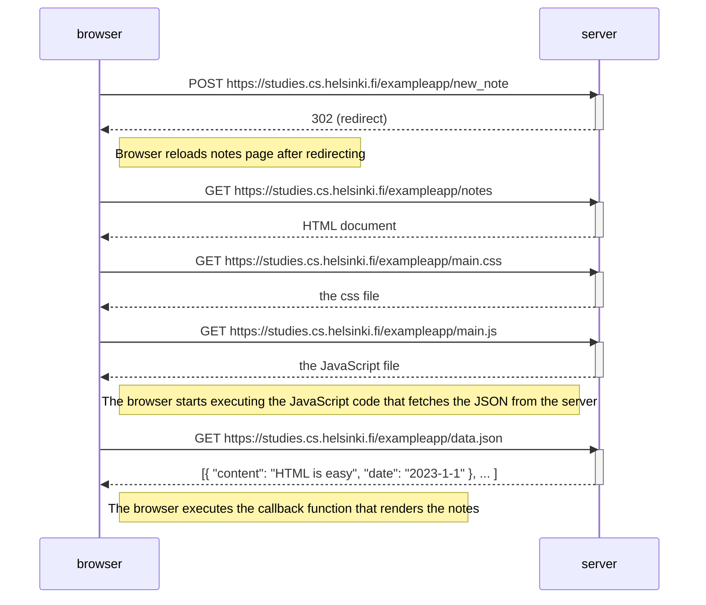
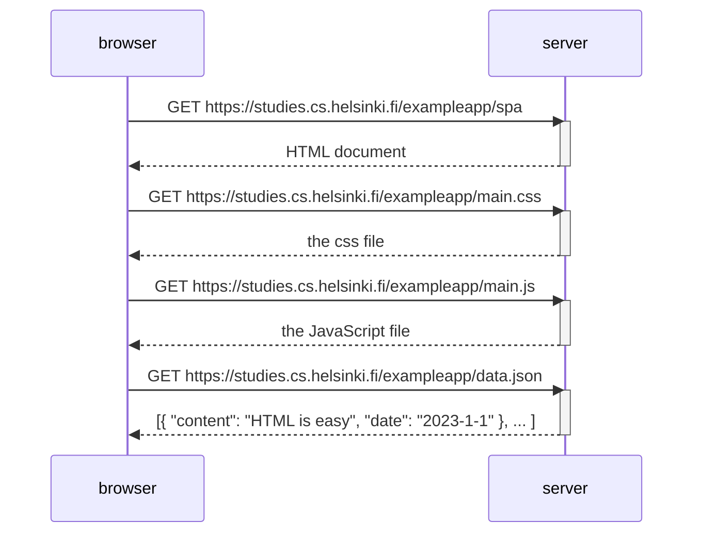
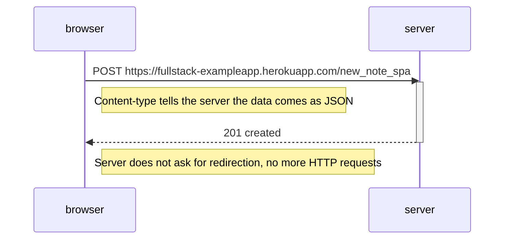

# FullStackOpen23 Osa0 Exercises

### Exercise 0.4

```mermaid
sequenceDiagram;
    participant browser;
    participant server;

    browser->>server: POST https://studies.cs.helsinki.fi/exampleapp/new_note;
    activate server;
    server-->>browser: 302 (redirect);
    deactivate server;

    Note right of browser: Browser reloads notes page after redirecting
    
    browser->>server: GET https://studies.cs.helsinki.fi/exampleapp/notes
    activate server
    server-->>browser: HTML document
    deactivate server
    
    browser->>server: GET https://studies.cs.helsinki.fi/exampleapp/main.css
    activate server
    server-->>browser: the css file
    deactivate server
    
    browser->>server: GET https://studies.cs.helsinki.fi/exampleapp/main.js
    activate server
    server-->>browser: the JavaScript file
    deactivate server
    
    Note right of browser: The browser starts executing the JavaScript code that fetches the JSON from the server
    
    browser->>server: GET https://studies.cs.helsinki.fi/exampleapp/data.json
    activate server
    server-->>browser: [{ "content": "HTML is easy", "date": "2023-1-1" }, ... ]
    deactivate server    

    Note right of browser: The browser executes the callback function that renders the notes
```

### Exercise 0.5

```mermaid
sequenceDiagram;
    participant browser;
    participant server;

    browser->>server: GET https://studies.cs.helsinki.fi/exampleapp/spa
    activate server
    server-->>browser: HTML document
    deactivate server
    
    browser->>server: GET https://studies.cs.helsinki.fi/exampleapp/main.css
    activate server
    server-->>browser: the css file
    deactivate server
    
    browser->>server: GET https://studies.cs.helsinki.fi/exampleapp/main.js
    activate server
    server-->>browser: the JavaScript file
    deactivate server
    
    browser->>server: GET https://studies.cs.helsinki.fi/exampleapp/data.json
    activate server
    server-->>browser: [{ "content": "HTML is easy", "date": "2023-1-1" }, ... ]
    deactivate server    
```

### Tehtävä 0.6

```mermaid
sequenceDiagram;
    participant browser;
    participant server;

    browser->>server: POST https://fullstack-exampleapp.herokuapp.com/new_note_spa
    activate server
    Note right of browser: Content-type tells the server the data comes as JSON
    server-->>browser: 201 created
    deactivate server

    Note right of browser: Server does not ask for redirection, no more HTTP requests
```
